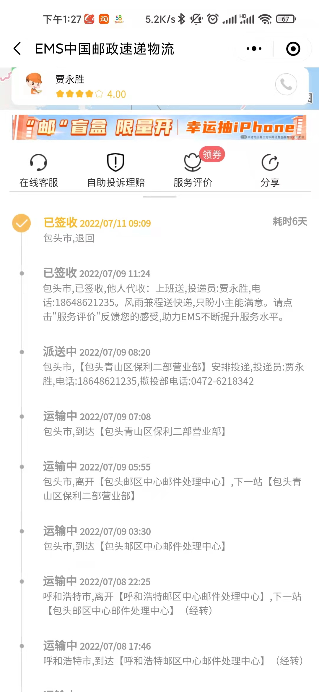
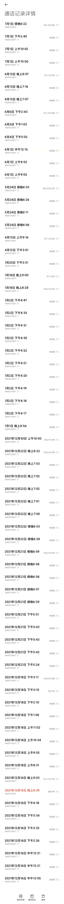

# 《用亲身经历告诉你，别买法拍房》

## 一、参与竞拍
年少无知的我，在低价的诱惑下，选择了买法拍房。后来我才明白，买卖讲究的是你情我愿，如果其中参杂着任意一方或第三方的不情愿，那就不是买卖了，那无异于是抢夺。当老赖不愿意低价卖给你的时候，你买过来就是抢了对方的钱袋子。更可怕的是，当你与公检法打交道的时候，没有背景的老百姓是非常吃亏的。
我买法拍房的缘由很多，一手房完全没有性价比，又没有我喜欢的大面积的房源，二手房房主心黑，要价太高，后来无意间关注到了法拍房，就起了参与法拍的萌芽。
抱着一时的冲动，终于在2021年9月份，我在包头市青山区人民法院的拍卖中，成功竞拍到了一套法拍房，本以为万事大吉，结果却是无尽的等待。

## 二、信念倒塌
当初的我守法信法，认为法官是一个无比高尚的职业，谁知道因为这个房子，让我看透了一切。每次给他们打电话，就得到了无数的拖延，他们用的最多的借口就是疫情，可是这近10个月内，可不是月月都有疫情，所谓疫情，就是他们的挡箭牌。没有疫情的时候，他们又说忙、人手不够、省高院领导检查走不开、有的时候干脆不接电话。他们有的时候也会说下个月去，到了下个月又说再下一个月去，面临无数的欺骗和拖延，我崩溃了。
我以为国家会有人管这种事情，我就向很多部门举报了这个问题，我向网上的各个平台举报，中纪委、最高院、政法委、最高检、人大、问政平台、甚至很多地方级别的平台、新闻平台都举报了。可是这近10个月内，没有收到任何一个部门的主动答复。很多电话要么打不通，要么踢皮球，你踢给我，我踢给他。那些新闻平台，别提他们有多懦弱了，只要涉及到公检法，一律不处理。
我想申请提级执行，结果包头市中级人民法院不受理，让我向包头市青山区人民法院寄送执行监督申请书，等我寄过去结果被他们退回。

## 三、设法自救
既然举报没人管，那就想想办法自救吧。本想通过拒执罪自诉的途径解决，结果向派出所报案，派出所不给报案回执，也不给不予立案通知书。法院那边的答复是，必须有报案回执才给你立案。看来这条路也是走不通。

## 四、权力不受监督
和我对接的是包头市青山区人民法院执行局局长赵亮，人家贵为局长一把手，知法犯法，想来就来，想回就回，权力不受监督，根本没有人管得了他们。我把法律依据都写在下面了，现在才明白，法律对付的只是老百姓，当权者不怕违法，他们违法没有成本。

**法律依据：**
1.	包头市青山区人民法院在执行行为中违反了《中华人民共和国民事诉讼法》法律中规定的六个月执行期限。
2.	包头市青山区人民法院在执行行为中违反了《最高人民法院关于人民法院民事执行中拍卖、变卖财产的规定》法规中的第三十条，关于裁定送达后的十五日内财产交付时效规定。
3.	《最高人民法院关于进一步完善执行权制约机制加强执行监督的意见》中规定 拍卖财产为不动产且被执行人或者他人无权占用的，人民法院应当依法负责腾退

## 五、随笔
顺便抱怨一下其他的，税法规定，税费各付，而且税务总局明确的通知了法拍房不得买家全部承担。可是税务总局发布后，他们依旧在拍卖公告上写着全部税费买受人承担。人家也知道违法，执法者违法又能怎么样呢？如果还有重来，我一定不会和公检法打交道，我宁可去买你情我愿的二手房。

## 证据
**执行监督申请书被退回**

**提级执行不立案**

**提级执行执行监督不立案**

**问政不予受理**

**举报次数其中之一**

**和执行局局长赵亮的通话记录**

